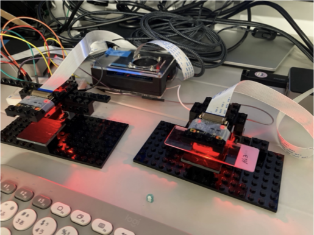
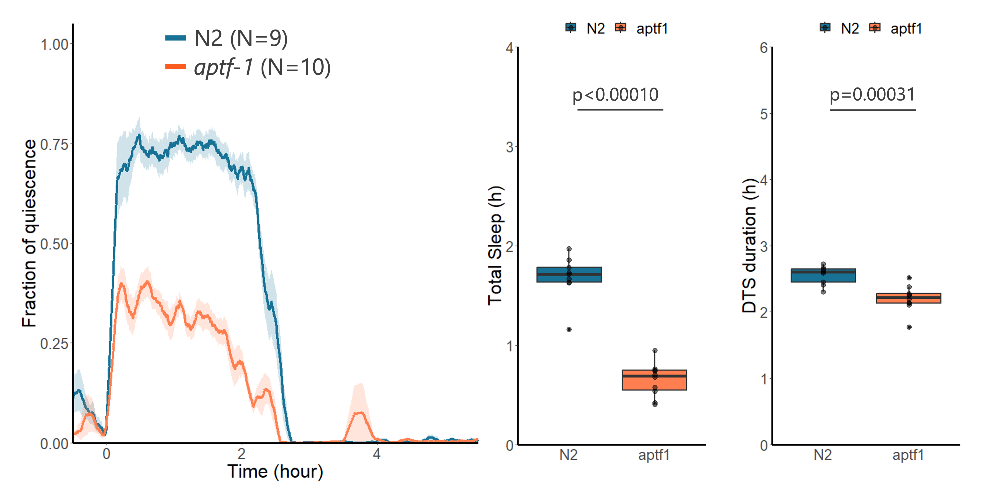

# Raspberry Pi Systems

研究室で使っているRaspberry Piシステムのスクリプトとドキュメントをまとめたリポジトリです。
現在2つのシステムが稼働しています。

## 稼働中のシステム

### 1. 温湿度監視システム — [temperature_humidity_notifier/](temperature_humidity_notifier/)

4つの部屋に置いたRaspberry Pi + DHT22センサーで温湿度を測り、NAS上のデータベースに
集約して、異常時と週次レポートをSlackに通知するシステムです。

| 目的 | 読む文書 |
|---|---|
| 仕組み・設計を知りたい | [Readme.md](temperature_humidity_notifier/Readme.md) |
| **Piを新品から作る・作り直す** | [SETUP_PI.md](temperature_humidity_notifier/SETUP_PI.md) → 続けてOPERATIONS.md |
| **システム全体を一から構築する** | [SETUP_PI.md](temperature_humidity_notifier/SETUP_PI.md) → [OPERATIONS.md](temperature_humidity_notifier/OPERATIONS.md) のフェーズ1〜5 |
| 日常運用・トラブル対応 | [OPERATIONS.md](temperature_humidity_notifier/OPERATIONS.md) のフェーズ6〜7 |

### 2. イメージングシステム — [elegans/](elegans/)

Raspberry Piカメラを使ったタイムラプス撮影・動画撮影のスクリプト群です。

撮影結果の例:

- ハードウェアの組み立て: [MakeLegoSystem.md](elegans/MakeLegoSystem.md)
- 動作環境: Raspberry Pi 4B（2/4/8GB RAM）、Raspberry Pi Zero WH（プレビューは動作しない）
- インストール作業はなく、スクリプトをPiに置いて実行するだけです

| スクリプト | 用途 |
|---|---|
| `ShowPreview.py` | カメラのプレビュー表示（ピント合わせ・画角調整用） |
| `TimeLapseCapture.py` | タイムラプス撮影 |
| `TimeLapseCapture_for_survival.py` | 生存率測定用のタイムラプス撮影 |
| `TimeLapseCapture_for_SIS_and_survival.py` | SIS・生存率測定用のタイムラプス撮影 |
| `TimeLapseCapture_withStim.py` | 刺激を与えながらのタイムラプス撮影 |

## Legacy/ について

[Legacy/](Legacy/) には、**現在使っていない**スクリプトと古い文書が入っています。
過去の実験の再現や、記録として残してあるものです。
**新しく作業を始めるときにここを参照しないでください**（現在の構成と矛盾する記述を含みます）。

| 中身 | 内容 |
|---|---|
| `temp_humid_notifier.py` | 温湿度監視の旧版（1台構成・Slackへ直接通知していた頃のもの） |
| `temperature_notifier_network.md` | 温湿度監視の旧セットアップ手順（旧版プログラム前提） |
| `MORNING_CHECKLIST_20260709.md` | 2026-07-09のNAS移行作業で使った一時メモ |
| `betta/` | ベタの撮影・解析スクリプト |
| `TimeLapseCapture*.py`, `VideoCapture.py` | 撮影スクリプトの旧版 |

`elegans/Legacy/` にも、イメージングスクリプトの旧版が置いてあります。

## Author

Shinichi Miyazaki (https://github.com/Shinichi-Miyazaki)

## License

MIT License
